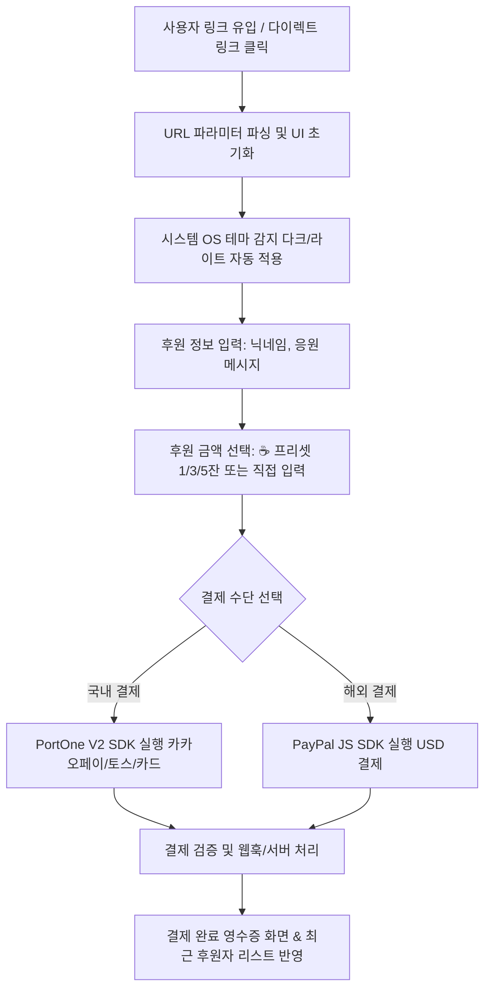

# ☕ 미니멀 커피 후원 플랫폼 개발 지침서 (Donation Platform Guide)

> **목적**: 개발자, 크리에이터, 오픈소스 메인테이너를 위한 모바일 퍼스트 미니멀 후원 플랫폼 구축 및 연동 지침서  
> **핵심 기능**: PortOne V2(국내 결제) & PayPal SDK(해외 결제), URL 쿼리 파라미터 기반 다이렉트 링크, 시스템 다크모드 자동 감지, 정적 호스팅 최적화

---

## 1. 📌 개요 및 기획 목표

* **서비스 정의**: 외부 링크(블로그, 깃허브, SNS 등)를 통해 손쉽게 유입되어 커피(후원금)를 전달할 수 있는 가볍고 직관적인 단일 페이지 후원 웹 애플리케이션
* **핵심 가치**:
  1. **무설치 & 초경량**: 별도 앱 설치나 복잡한 회원가입 없이 URL 클릭 한 번으로 후원 완료
  2. **국내/해외 통합 결제**: PortOne(국내 카드/간편결제) 및 PayPal(해외 달러 결제) 동시 지원
  3. **다이렉트 링크 & 딥링크 지원**: URL 파라미터(`target`, `amount` 등)를 통한 크리에이터 및 금액 자동 세팅
  4. **시스템 다크모드 자동 연동**: OS 설정값에 즉각 반응하는 매끄러운 UX
  5. **서버리스/정적 호스팅 최적화**: GitHub Pages, Cloudflare Pages, Vercel 등에서 무료/초저비용 운영 가능

---

## 2. 🗺️ 사용자 플로우 (User Flow)



---

## 3. 🎨 화면 구성 및 UI/UX 설계 (Wireframe)

### 3.1. 모바일 퍼스트 레이아웃 원칙
* **Thumb Zone 중심 설계**: 모바일 화면(375px 이상)에서 한 손 엄지손가락으로 쉽게 닿는 하단/중앙 영역에 핵심 버튼 및 입력창 배치
* **PC 확장 뷰**: 데스크톱에서는 중앙 정렬된 프리미엄 카드(Max-width 480px~640px) 형태로 컴팩트하게 렌더링

### 3.2. 주요 컴포넌트 구조
1. **헤더 (Header)**:
   - 크리에이터 프로필 아바타 & 닉네임 (`target` 파라미터에 따라 동적 변경 가능)
   - 한 줄 소개 문구 (예: *"오픈소스 유지보수와 커피 수혈을 위한 후원입니다."*)
   - 시스템 테마 상태 표시 또는 수동 토글 버튼
2. **후원 금액 선택 (Coffee Preset Buttons)**:
   - ☕ 1잔: ₩3,000 / $3
   - ☕ 3잔: ₩9,000 / $9
   - ☕ 5잔: ₩15,000 / $15
   - ✏️ 커스텀 금액 직접 입력 (Custom Amount Input)
3. **후원자 정보 입력**:
   - 닉네임 (Input, 비워둘 시 '익명의 후원자' 처리)
   - 응원 메시지 (Textarea, 최대 200자, 글자수 카운터)
4. **결제 수단 선택 (Dual Gateway)**:
   - **[ 💳 PortOne 국내 결제 ]**: 토스페이먼츠, 카카오페이, 네이버페이, 신용/체크카드
   - **[ 🅿️ PayPal 해외 결제 ]**: PayPal Buttons JS 컨테이너 렌더링
5. **최근 후원자 리스트 (Social Proof)**:
   - 최근 후원한 사용자들의 닉네임, 응원 메시지, 커피 잔 수 롤링 또는 리스트 표시

---

## 4. 🛠️ 기술 스택 및 라이브러리

| 레이어 | 기술 스택 | 설명 |
| :--- | :--- | :--- |
| **Frontend** | Vanilla HTML5, Modern JS (ES6+) | 빌드 도구 없이 브라우저에서 즉시 실행되는 초경량 구조 |
| **Styling** | Tailwind CSS (CDN) + Vanilla CSS | CSS 변수(`prefers-color-scheme`) 및 다크모드 유틸리티 클래스 활용 |
| **Icons** | Iconify Solar / Feather Icons | 가볍고 심플한 모던 아이콘 세트 |
| **국내 결제** | PortOne SDK V2 | 포트원 최신 브라우저 SDK (`https://cdn.portone.io/v2/browser-sdk.js`) |
| **해외 결제** | PayPal JavaScript SDK | PayPal 공식 Checkout 버튼 스크립트 |
| **Backend (선택)** | Node.js / Serverless (Cloudflare Worker/Vercel) | 결제 위변조 검증, 웹훅 수신, DB 저장(Supabase/Firebase 등) |

---

## 5. ⚙️ 핵심 기술 구현 상세 가이드

### 5.1. 시스템 다크모드 자동 감지 (Vanilla JS & CSS)

```javascript
// OS 다크모드 감지 및 이벤트 리스너 등록
function initTheme() {
  const darkModeMediaQuery = window.matchMedia('(prefers-color-scheme: dark)');
  
  function applyTheme(isDark) {
    if (isDark) {
      document.documentElement.classList.add('dark');
    } else {
      document.documentElement.classList.remove('dark');
    }
  }

  // 초기 로드 시 감지
  applyTheme(darkModeMediaQuery.matches);

  // OS 설정 변경 시 실시간 반영
  darkModeMediaQuery.addEventListener('change', (e) => applyTheme(e.matches));
}
```

### 5.2. 다이렉트 링크 파라미터 파싱 (`target`, `amount`)

```javascript
// URL 쿼리스트링 파싱
function parseUrlParams() {
  const params = new URLSearchParams(window.location.search);
  const target = params.get('target') || 'default_creator';
  const amount = parseInt(params.get('amount'), 10) || 3000;
  const message = params.get('message') || '';

  return { target, amount, message };
}
```

### 5.3. PortOne V2 결제 연동 (인앱 브라우저 호환성 포함)

```javascript
async function requestPortOnePayment({ target, amount, nickname, message }) {
  const paymentId = `pay_${Date.now()}_${Math.random().toString(36).substring(2, 7)}`;
  
  try {
    const response = await PortOne.requestPayment({
      storeId: "YOUR_STORE_ID",
      paymentId: paymentId,
      orderName: `${target}님을 위한 커피 후원`,
      totalAmount: amount,
      currency: "CURRENCY_KRW",
      payMethod: "CARD", // 또는 EASY_PAY 등
      customer: {
        fullName: nickname || "익명",
      },
      customData: {
        target: target,
        message: message,
      },
      // 모바일 인앱 브라우저(카카오톡, 인스타 등) 리디렉션 대응 필수
      redirectUrl: `${window.location.origin}/donation-complete.html?paymentId=${paymentId}&target=${target}`
    });

    if (response.code != null) {
      // 결제 실패 처리
      alert(`결제 실패: ${response.message}`);
      return;
    }

    // 결제 성공 처리 (서버 검증 요청)
    handlePaymentSuccess(response);
  } catch (error) {
    console.error("PortOne 결제 요청 오류:", error);
  }
}
```

### 5.4. PayPal JS SDK 결제 연동

```javascript
function initPayPalButton({ target, getAmountUSD, getNickname, getMessage }) {
  if (!window.paypal) return;

  paypal.Buttons({
    createOrder: (data, actions) => {
      const usdAmount = getAmountUSD(); // 예: 커피 1잔당 $3 환산
      return actions.order.create({
        purchase_units: [{
          description: `Coffee donation for ${target}`,
          amount: {
            currency_code: "USD",
            value: usdAmount.toFixed(2)
          },
          custom_id: JSON.stringify({ target, nickname: getNickname(), message: getMessage() })
        }]
      });
    },
    onApprove: async (data, actions) => {
      const details = await actions.order.capture();
      alert(`후원 감사합니다, ${details.payer.name.given_name}님!`);
      // 후원 완료 화면 전환 및 리스트 갱신
    },
    onError: (err) => {
      console.error("PayPal 에러:", err);
    }
  }).render('#paypal-button-container');
}
```

---

## 6. 🛡️ 보안 및 운영 시 고려사항 (Critical Best Practices)

1. **결제 위변조 방지 (Server-side Validation)**:
   - 프론트엔드에서 결제창을 띄우더라도, 최종 후원 처리 시 백엔드(또는 Serverless Function)에서 PortOne/PayPal API를 호출하여 실제 결제된 금액과 `paymentId`를 조회·대조해야 합니다.
2. **모바일 인앱 브라우저(In-App Browser) 팝업 차단 대응**:
   - 카카오톡, 인스타그램, 페이스북 등의 인앱 브라우저 환경에서는 결제 팝업창이 차단되거나 세션이 종료될 수 있습니다.
   - 반드시 **`redirectUrl` (m_redirect_url)** 파라미터를 지정하여 페이지 전환 방식으로 결제가 안전하게 복귀되도록 구현해야 합니다.
3. **타겟 식별자(`target`) 메타데이터 전송**:
   - 다이렉트 링크를 통해 여러 크리에이터가 하나의 도메인을 공유할 수 있으므로, 결제 메타데이터(`customData` / `custom_id`)에 반드시 대상 식별자를 포함해야 정산 및 리스트 분리가 가능합니다.

---

## 7. 🔗 다이렉트 링크 활용 예시

| 링크 유형 | URL 예시 | 동작 결과 |
| :--- | :--- | :--- |
| **기본 접속** | `https://donate.wafflecomm.com/` | 기본 프로필 로드, 기본 1잔(₩3,000) 선택 |
| **특정 개발자 지정** | `https://donate.wafflecomm.com/?target=insub` | `insub` 크리에이터 프로필 자동 로드 |
| **금액 지정 링크** | `https://donate.wafflecomm.com/?target=insub&amount=9000` | 커피 3잔(₩9,000) 버튼 자동 활성화 |
| **메시지 포함 링크** | `https://donate.wafflecomm.com/?target=insub&amount=15000&message=항상응원합니다` | 응원 메시지 입력 필드 사전 입력 |

---

## 8. 📂 프로젝트 파일 구조 (권장 표준)

```text
coffee-donation/
├── index.html                  # 시맨틱 마크업, 프리셋 버튼, 결제 컨테이너
├── style.css                   # Tailwind CDN 오버라이드, 테마 CSS 변수, 트랜지션
├── script.js                   # URL 파싱, 다크모드 감지, PortOne/PayPal 이벤트 로직
├── donation-complete.html      # 결제 완료 영수증 및 후원 감사 페이지
└── asset/                      # 커피 아이콘, 기본 아바타, 뱃지 등
```

---

## 9. 🚀 개발 및 배포 체크리스트 (QA Guide)

- [ ] **반응형 뷰포트**: 375px(모바일) ~ 1920px(PC) 전 해상도에서 UI 깨짐 없이 카드 레이아웃 유지
- [ ] **OS 테마 전환**: 윈도우/macOS/iOS/Android 다크/라이트 전환 시 실시간 UI 색상 반전 확인
- [ ] **URL 파라미터 파싱**: `?target=xxx&amount=5000` 접속 시 해당 값으로 UI 자동 세팅 검증
- [ ] **PortOne 샌드박스 테스트**: 테스트 모드에서 신용카드 및 카카오페이 결제창 정상 호출 및 콜백 수신
- [ ] **PayPal 샌드박스 테스트**: PayPal 샌드박스 계정으로 USD 결제 승인(`onApprove`) 테스트
- [ ] **인앱 브라우저 복귀 검증**: 모바일 카카오톡/인스타 링크 인앱 브라우저에서 `redirectUrl` 정상 작동 여부
- [ ] **정적 호스팅 배포**: GitHub Pages 또는 Cloudflare Pages에 배포 후 HTTPS 정상 작동 확인

---
*문서 버전: v1.0.0 | 작성일: 2026-08-30 | 와플커뮤니케이션 개발 표준*
